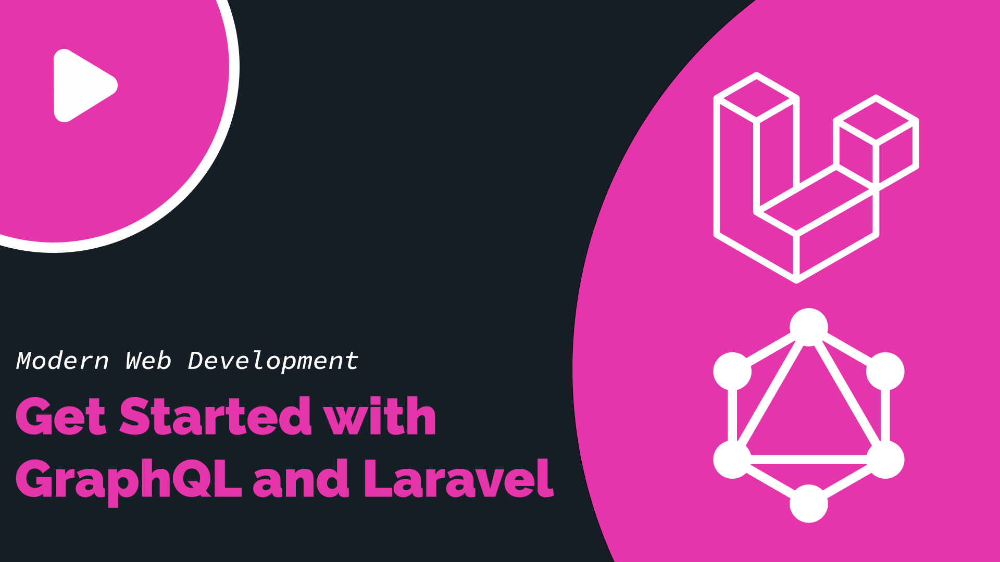
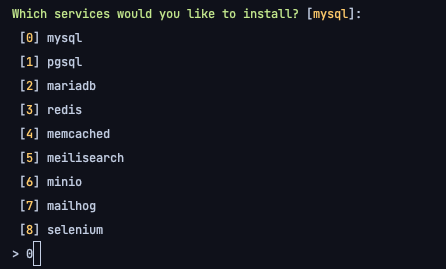
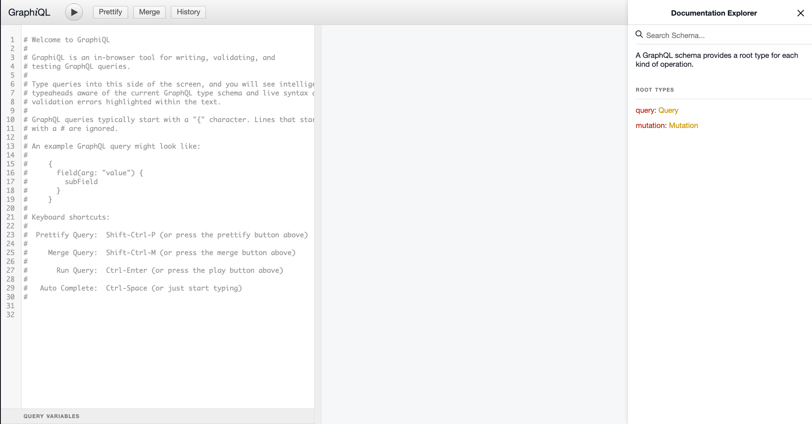
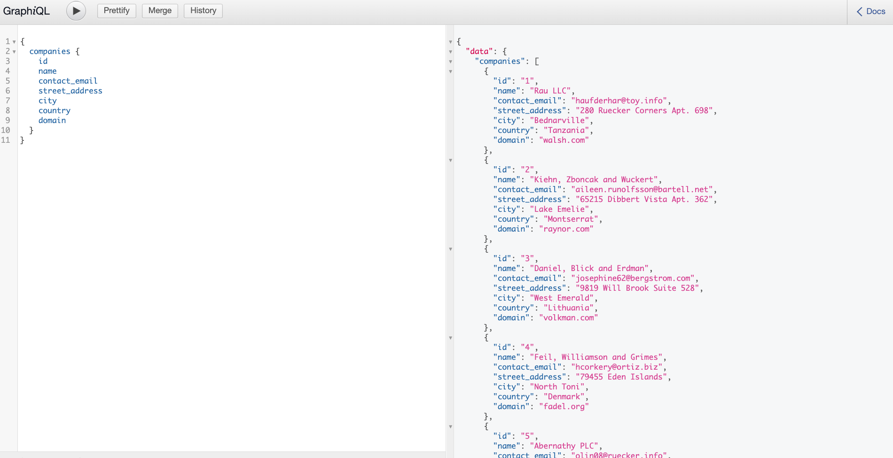
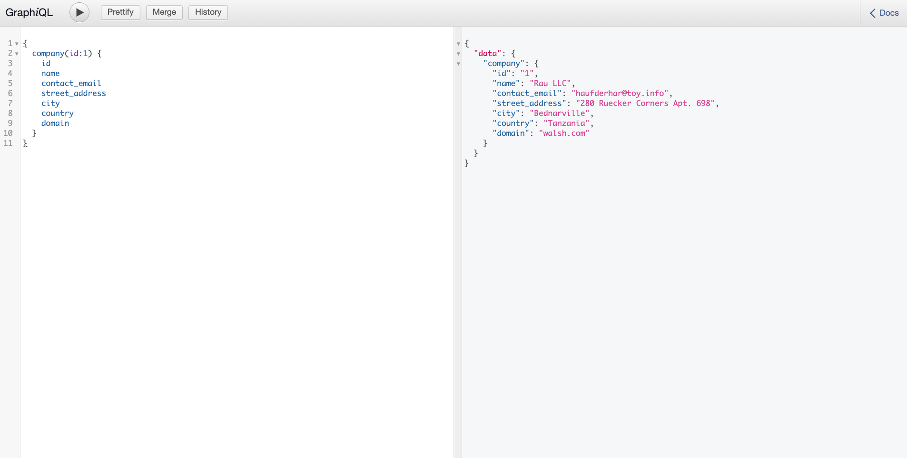
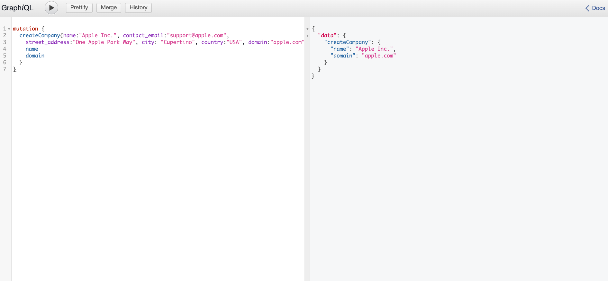
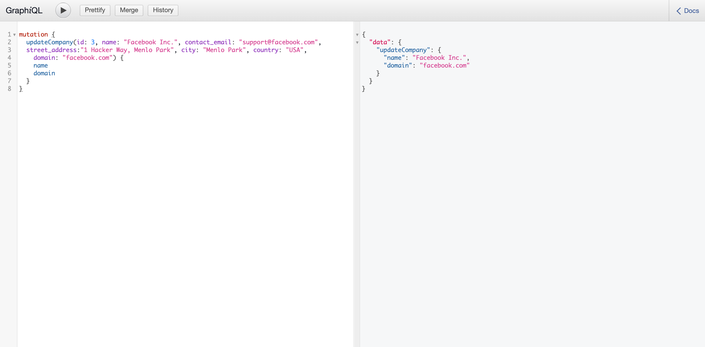
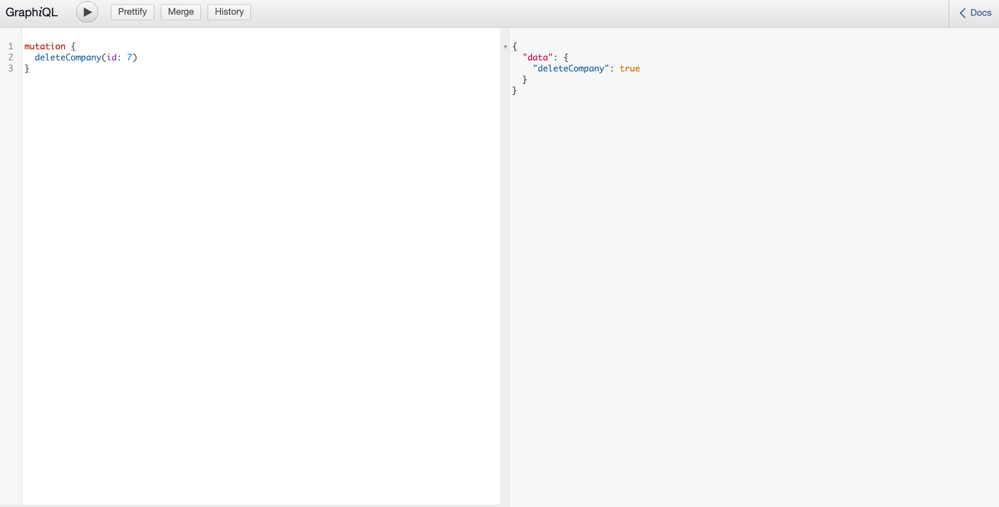

# Get Started with GraphQL and Laravel
GraphQL is a powerful REST alternative that allows developers to build APIs. We will be using GraphQL to create a 
simple CRUD application that allows us to create, read, update and delete sports players. 

## Setup the project

### Prerequisites
1. [PHP](https://www.php.net/)
2. [Composer](https://getcomposer.org/)
3. [NPM](https://www.npmjs.com/) (optional)
4. [Docker](https://www.docker.com/)


### Create new Laravel Project
Use composer to create a new Laravel project by running:
```
composer create-project --prefer-dist laravel/laravel graphql-basics
```

### Install Laravel Sail
We will be using Laravel Sail to run our local environment. Sail allows us to seamlessly run Docker without complex 
configuration
``` 
composer require laravel/sail --dev
php artisan sail:install
```


Select the mysql service

### Start Docker
Create a sail shortcut:
``` 
alias sail='[ -f sail ] && bash sail || bash vendor/bin/sail'
```

Start Sail & Docker:
``` 
sail up -d
```

### Install GraphQL Laravel library
The most popular GraphQL libraries for Laravel are [Rebing](https://github.com/rebing/graphql-laravel) & [Lighthouse](https://lighthouse-php.com/), in our tutorial we will be using Rebing
which we can install by running:
``` 
composer require rebing/graphql-laravel
```

Then publish the config file
``` 
sail artisan vendor:publish --provider="Rebing\GraphQL\GraphQLServiceProvider"
```

## Prepare database migrations & models
Run the following command to create the Company model, migration and factory:
``` 
sail artisan make:model Company -m -f
```

### Migration
Edit the  generated migration file by replacing its content with the following:
```php
<?php

use Illuminate\Database\Migrations\Migration;
use Illuminate\Database\Schema\Blueprint;
use Illuminate\Support\Facades\Schema;

class CreateCompaniesTable extends Migration
{
    /**
     * Run the migrations.
     *
     * @return void
     */
    public function up()
    {
        Schema::create('companies', function (Blueprint $table) {
            $table->id();
            $table->string('name');
            $table->string('contact_email');
            $table->string('street_address');
            $table->string('city');
            $table->string('country');
            $table->string('domain');
            
            $table->timestamps();
        });
    }

    /**
     * Reverse the migrations.
     *
     * @return void
     */
    public function down()
    {
        Schema::dropIfExists('companies');
    }
}
```
### Model
Now, add these fields as `$fillable` properties for the Company model.
```php 
<?php

namespace App\Models;

use Illuminate\Database\Eloquent\Factories\HasFactory;
use Illuminate\Database\Eloquent\Model;

class Company extends Model
{
    use HasFactory;

    /**
     * The attributes that are mass assignable.
     *
     * @var string[]
     */
    protected $fillable = [
        'name',
        'contact_email',
        'street_address',
        'city',
        'country',
        'domain'
    ];
}

```
### Factory
Let's create our Company factory for seeding purposes. 
```php
<?php

namespace Database\Factories;

use Illuminate\Database\Eloquent\Factories\Factory;

class CompanyFactory extends Factory
{
    /**
     * Define the model's default state.
     *
     * @return array
     */
    public function definition()
    {
        return [
            'name' => $this->faker->company,
            'contact_email' => $this->faker->companyEmail,
            'street_address' => $this->faker->streetAddress,
            'city' => $this->faker->city,
            'country' => $this->faker->country,
            'domain' => $this->faker->domainName
        ];
    }
}

```

### Update Database Seeder
```php
<?php

namespace Database\Seeders;

use App\Models\Company;
use Illuminate\Database\Seeder;

class DatabaseSeeder extends Seeder
{
    /**
     * Seed the application's database.
     *
     * @return void
     */
    public function run()
    {
        Company::factory(10)->create();
    }
}
```

### Migrate & Seed Database 
Run this command to seed our database:
``` 
sail artisan migrate --seed
```

## Build our GraphQL Server
Let's start defining our GraphQL schema

### Create GraphQL Type for Company
Run the following command to create our GraphQL type:
```
sail artisan make:graphql:type CompanyType
``` 
Then navigate to the `app/GraphQL/Types` directory and modify the file like so:
```php
<?php

declare(strict_types=1);

namespace App\GraphQL\Types;

use App\Models\Company;
use GraphQL\Type\Definition\Type;
use Rebing\GraphQL\Support\Type as GraphQLType;

class CompanyType extends GraphQLType
{
    protected $attributes = [
        'name' => 'Company',
        'description' => '',
        'model' => Company::class
    ];

    public function fields(): array
    {
        return [
            'id' => [
                'type' => Type::id(),
                'description' => 'The auto incremented ID of a company'
            ],
            'name' => [
                'type' => Type::nonNull(Type::string()),
                'description' => 'The name of a company'
            ],
            'contact_email' => [
                'type' => Type::nonNull(Type::string()),
                'description' => 'The primary point of contact for a company'
            ],
            'street_address' => [
                'type' => Type::nonNull(Type::string()),
                'description' => 'The street address of a company headquarters'
            ],
            'city' => [
                'type' => Type::nonNull(Type::string()),
                'description' => 'The city of a company headquarters'
            ],
            'country' => [
                'type' => Type::nonNull(Type::string()),
                'description' => 'The country of a company headquarters'
            ],
            'domain' => [
                'type' => Type::nonNull(Type::string()),
                'description' => 'The web domain for a company'
            ]
        ];
    }
}

```

### Create GraphQL Queries
Queries will be used to retrieve data from the database. 

#### CompanyQuery
Run the following to create the company query: 
``` 
sail artisan make:graphql:query CompanyQuery
```

Then navigate to the `app/GraphQL/Queries` directory and modify the file like so:
```php
<?php

declare(strict_types=1);

namespace App\GraphQL\Queries;

use App\Models\Company;
use Closure;
use GraphQL\Type\Definition\ResolveInfo;
use GraphQL\Type\Definition\Type;
use Rebing\GraphQL\Support\Facades\GraphQL;
use Rebing\GraphQL\Support\Query;
use Rebing\GraphQL\Support\SelectFields;

class CompanyQuery extends Query
{
    protected $attributes = [
        'name' => 'company'
    ];

    public function type(): Type
    {
        return GraphQL::type('Company');
    }

    public function args(): array
    {
        return [
            'id' => [
                'name' => 'id',
                'type' => Type::id(),
                'rules' => ['required']
            ],
        ];
    }

    public function resolve($root, array $args, $context, ResolveInfo $resolveInfo, Closure $getSelectFields)
    {
        return Company::findOrFail($args['id']);
    }
}

```

#### CompaniesQuery
Run the following to create the companies query:
``` 
sail artisan make:graphql:query CompaniesQuery
```

Then navigate to the `app/GraphQL/Queries` directory and modify the file like so:
```php
<?php

declare(strict_types=1);

namespace App\GraphQL\Queries;

use App\Models\Company;
use Closure;
use GraphQL\Type\Definition\ResolveInfo;
use GraphQL\Type\Definition\Type;
use Rebing\GraphQL\Support\Facades\GraphQL;
use Rebing\GraphQL\Support\Query;
use Rebing\GraphQL\Support\SelectFields;

class CompaniesQuery extends Query
{
    protected $attributes = [
        'name' => 'companies'
    ];

    public function type(): Type
    {
        return Type::listOf(GraphQL::type('Company'));
    }

    public function resolve($root, array $args, $context, ResolveInfo $resolveInfo, Closure $getSelectFields)
    {
        return Company::all();
    }
}

```

### Create the GraphQL Mutations
Mutations are used insert, update, and delete an entity.
#### Create Company Mutation
Run the following command to create new mutation:
``` 
sail artisan make:graphql:mutation CreateCompanyMutation
```
Then navigate to the `app/GraphQL/Mutations` directory and modify the file like so:
```php
<?php

declare(strict_types=1);

namespace App\GraphQL\Mutations;

use App\Models\Company;
use Closure;
use GraphQL\Type\Definition\ResolveInfo;
use GraphQL\Type\Definition\Type;
use Rebing\GraphQL\Support\Facades\GraphQL;
use Rebing\GraphQL\Support\Mutation;
use Rebing\GraphQL\Support\SelectFields;

class CreateCompanyMutation extends Mutation
{
    protected $attributes = [
        'name' => 'createCompany'
    ];

    public function type(): Type
    {
        return GraphQL::type('Company');
    }

    public function args(): array
    {
        return [
            'name' => [
                'type' => Type::nonNull(Type::string()),
                'description' => 'The name of a company'
            ],
            'contact_email' => [
                'type' => Type::nonNull(Type::string()),
                'description' => 'The primary point of contact for a company',
                'rules' => ['email']
            ],
            'street_address' => [
                'type' => Type::nonNull(Type::string()),
                'description' => 'The street address of a company headquarters'
            ],
            'city' => [
                'type' => Type::nonNull(Type::string()),
                'description' => 'The city of a company headquarters'
            ],
            'country' => [
                'type' => Type::nonNull(Type::string()),
                'description' => 'The country of a company headquarters'
            ],
            'domain' => [
                'type' => Type::nonNull(Type::string()),
                'description' => 'The web domain for a company'
            ]
        ];
    }

    public function resolve($root, array $args, $context, ResolveInfo $resolveInfo, Closure $getSelectFields)
    {
        return Company::create($args);
    }
}

```
#### Update Company Mutation
Run the following command to create new mutation:
``` 
sail artisan make:graphql:mutation UpdateCompanyMutation
```
Then navigate to the `app/GraphQL/Mutations` directory and modify the file like so:
```php
<?php

declare(strict_types=1);

namespace App\GraphQL\Mutations;

use App\Models\Company;
use Closure;
use GraphQL\Type\Definition\ResolveInfo;
use GraphQL\Type\Definition\Type;
use Rebing\GraphQL\Support\Facades\GraphQL;
use Rebing\GraphQL\Support\Mutation;
use Rebing\GraphQL\Support\SelectFields;

class UpdateCompanyMutation extends Mutation
{
    protected $attributes = [
        'name' => 'updateCompany'
    ];

    public function type(): Type
    {
        return GraphQL::type('Company');
    }

    public function args(): array
    {
        return [
            'id' => [
                'name' => 'id',
                'type' =>  Type::nonNull(Type::int()),
            ],
            'name' => [
                'type' => Type::nonNull(Type::string()),
                'description' => 'The name of a company'
            ],
            'contact_email' => [
                'type' => Type::nonNull(Type::string()),
                'description' => 'The primary point of contact for a company',
                'rules' => ['email']
            ],
            'street_address' => [
                'type' => Type::nonNull(Type::string()),
                'description' => 'The street address of a company headquarters'
            ],
            'city' => [
                'type' => Type::nonNull(Type::string()),
                'description' => 'The city of a company headquarters'
            ],
            'country' => [
                'type' => Type::nonNull(Type::string()),
                'description' => 'The country of a company headquarters'
            ],
            'domain' => [
                'type' => Type::nonNull(Type::string()),
                'description' => 'The web domain for a company'
            ]
        ];
    }

    public function resolve($root, array $args, $context, ResolveInfo $resolveInfo, Closure $getSelectFields)
    {
        $company = Company::findOrFail($args['id']);
        
        $company->update($args);

        return $company->refresh();
    }
}

```
#### Delete Company Mutation
Run the following command to create new mutation:
``` 
sail artisan make:graphql:mutation DeleteCompanyMutation
```
Then navigate to the `app/GraphQL/Mutations` directory and modify the file like so:
```php
<?php

declare(strict_types=1);

namespace App\GraphQL\Mutations;

use App\Models\Company;
use Closure;
use GraphQL\Type\Definition\ResolveInfo;
use GraphQL\Type\Definition\Type;
use Rebing\GraphQL\Support\Mutation;
use Rebing\GraphQL\Support\SelectFields;

class DeleteCompanyMutation extends Mutation
{
    protected $attributes = [
        'name' => 'deleteCompany'
    ];

    public function type(): Type
    {
        return Type::boolean();
    }

    public function args(): array
    {
        return [
            'id' => [
                'name' => 'id',
                'type' =>  Type::id(),
            ],
        ];
    }

    public function resolve($root, array $args, $context, ResolveInfo $resolveInfo, Closure $getSelectFields)
    {
        $company = Company::findOrFail($args['id']);

        return $company->delete();
    }
}

```
### Load Schema
We need to register to schema within te GraphQL configuration file, located at `config/graphql.php`:
```php 
'schemas' => [
        'default' => [
            'query' => [
                // ExampleQuery::class,
                \App\GraphQL\Queries\CompanyQuery::class,
                \App\GraphQL\Queries\CompaniesQuery::class
            ],
            'mutation' => [
                // ExampleMutation::class,
                \App\GraphQL\Mutations\CreateCompanyMutation::class,
                \App\GraphQL\Mutations\UpdateCompanyMutation::class,
                \App\GraphQL\Mutations\DeleteCompanyMutation::class
            ],
            // The types only available in this schema
            'types' => [
                \App\GraphQL\Types\CompanyType::class
            ],

            // Laravel HTTP middleware
            'middleware' => null,

            // Which HTTP methods to support; must be given in UPPERCASE!
            'method' => ['GET', 'POST'],

            // An array of middlewares, overrides the global ones
            'execution_middleware' => null,
        ],
    ],
```
## Run the Application
Since we already started the app using Sail, we can go to the url: http://localhost/graphiql to test our endpoints


### Return all companies
```graphql
{
  companies {
    id 
    name
    contact_email 
    street_address
    city
    country
    domain
  }
}
```


### Return single company
```graphql
{
  company(id:1) {
    id 
    name
    contact_email 
    street_address
    city
    country
    domain
  }
}
```

### Create company
```graphql
mutation {
  createCompany(name:"Apple Inc.", contact_email:"support@apple.com", 
    street_address:"One Apple Park Way", city: "Cupertino", country:"USA", domain:"apple.com") {
    name 
    domain
  }
}
```


### Update Company
```graphql
mutation {
  updateCompany(id: 3, name: "Facebook Inc.", contact_email: "support@facebook.com",
  street_address:"1 Hacker Way, Menlo Park", city: "Menlo Park", country: "USA", 
    domain: "facebook.com") {
    name
    domain
  }
}
```

### Delete Company
```graphql
mutation {
  deleteCompany(id: 7)
}
```



## Recap
In conclusion, GraphQL is a very powerful tool for building modern APIs. If you found this tutorial useful, considering subscribing to my YouTube channel where I record
programming content on the regular. 

[Twitter](https://twitter.com/solocodes_me)
[Github](https://github.com/Solomon04)
[YouTube](https://www.youtube.com/c/Icodestuff)
[Patreon](https://www.patreon.com/icodestuff)
